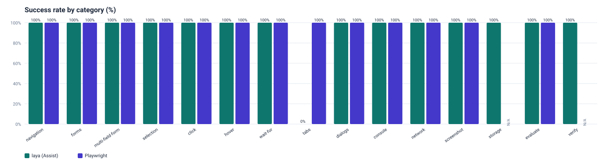
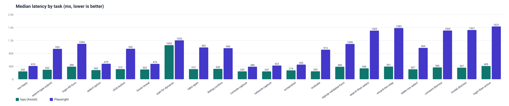
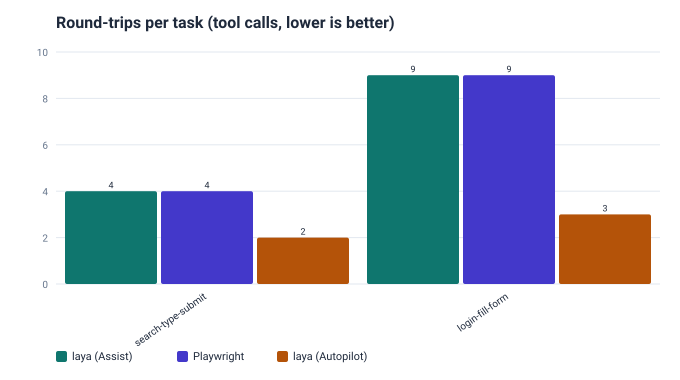
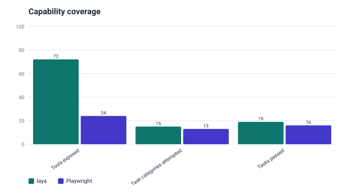

# laya-browser-mcp

**A superset of [Playwright MCP](https://github.com/microsoft/playwright-mcp) with a local
Laya on-device decision engine.** It exposes the familiar ref-based Playwright
browser tools (Assist mode) and adds an Autopilot loop (`laya_run_goal`) that resolves each
step's element/action choice **on-device** with a local Laya "System 1" model, so the client
LLM is invoked far less often. When the local model is not confident, Autopilot escalates the
single step to the client's own LLM via **MCP sampling**.

The on-device decision is one signal behind the `0.85` escalation gate, not a sub-100ms
fast path on CPU: the current 421M-parameter checkpoints cost ~2.3 ms per input token per
forward row on an 8-core CPU, so a model-decided step takes ~1.5-4 s (see [Weights](#weights)).
Deterministic rule steps cost no model call at all. It picks the best available
onnxruntime execution provider automatically (CUDA on Linux x64, DirectML on Windows x64/arm64,
else CPU; WebGPU is experimental and override-only); on a machine
with a supported GPU the per-decide cost is expected to drop, but that speedup is
to-be-measured on your hardware (this project's CI has no GPU). See
[Execution provider selection](#execution-provider-selection).

- [What it is and honest positioning](#what-it-is-and-honest-positioning)
- [Quick start (easy setup)](#quick-start-easy-setup)
- [Tools](#tools)
- [Benchmark results](#benchmark-results)
- [Autopilot](#autopilot)
- [How it works](#how-it-works)
- [Execution provider selection](#execution-provider-selection)
- [Configuration reference](#configuration-reference)
- [Development](#development)
- [Weights](#weights)
- [License and attribution](#license-and-attribution)

## What it is and honest positioning

laya-browser-mcp is a **drop-in superset of Playwright MCP** plus a **fast local decision
layer with an LLM fallback**. It is not a magic autonomous agent. Please read this before
deciding whether it fits your use case:

- **Playwright-MCP superset.** Every core browser tool uses the same ref-based contract
  (`browser_snapshot` gives `[ref=eN]` markers; you pass a ref as `target` to
  `browser_click` / `browser_type` / ...). Migrating from Playwright MCP is a config change.
- **Strong on clean, structured forms.** The web-agent checkpoint scores roughly **97.7%
  per-step** on clean synthetic forms (search boxes, filters, logins, checkouts).
- **Weak on arbitrary real sites.** On real-world Mind2Web pages it is only right about
  **1 step in 5** end to end. Autopilot leans on deterministic rules and LLM escalation to
  cover the gap, and it still may fail on messy sites.
- **The reference model is not web-tuned.** The bundled reference/stub decision layer is
  deterministic rules, not a web-tuned model. Treat Autopilot numbers here as the rule
  layer's behaviour, not a model benchmark.
- **NOT a fully autonomous general web agent.** Do not deploy it unattended against sites
  where a wrong click matters. `DONE` is never trusted on its own: every run ends with an
  **independent final-page verification**.
- **Works with no weights.** Assist mode is fully standalone (no model needed), and so is the
  goal command: with no local weights it plans every step through the client LLM (MCP
  sampling). It only degrades to an Assist-mode hint when there is no planner at all, i.e. the
  client does not support sampling either.

## Setup

Requires **Node.js 22+** and **pnpm 10+**. The steps below are ordered; run them from the
repository root.

```sh
# 1. Install dependencies
pnpm install

# 2. Rebuild the native modules (onnxruntime-node + esbuild)
#    Their build scripts are ignored on install by default; this approves them so the real
#    ONNX engine can load. Safe to run even if you only ever use Assist mode.
pnpm rebuild onnxruntime-node esbuild

# 3. Install the browsers Playwright drives
#    Chromium is enough for the default headless setup; the headless-shell and Firefox builds
#    are used by the cross-browser tests and benchmark.
pnpm exec playwright install chromium chromium-headless-shell firefox

# 4. Build the server (emits dist/index.js)
pnpm run build
```

Steps 1, 3, and 4 alone are enough to run **Assist mode** with no model weights. Step 2 and a
model bundle (below) are only needed for the on-device **Autopilot** engine.

### Get the model (optional, for on-device Autopilot)

Autopilot runs without any model (it plans every step through the client LLM via MCP
sampling, or uses the deterministic reference stub). To run **fully on-device**, point
`LAYA_MODEL_DIR` at a local ONNX bundle. The repo ships a reproducible fetch/export script:

```sh
# Simplest: download a prebuilt reference ONNX bundle (no Python needed).
bash scripts/prepare-model.sh --reference --out ./model

# Then point the server at it:
export LAYA_MODEL_DIR="$PWD/model"
```

Model weights (`*.onnx`, `*.onnx.data`, `model/`) are **gitignored and never committed**. See
[Weights](#weights) for the web-agent export path and its honest accuracy numbers. When
`LAYA_MODEL_DIR` is unset and no weights are found, the server uses the client-LLM planner or
the reference stub, so setup stays optional.

### Verify the setup

```sh
pnpm run typecheck   # tsc --noEmit
pnpm test            # vitest run (WebKit self-skips if system libs are missing)
pnpm run bench       # offline stub benchmark, prints a coverage table
```

### Environment variable reference

The complete, authoritative list lives in the header comment of
[`src/config.ts`](src/config.ts) (config is parsed there exactly once). The most commonly used
variables:

| Variable | Default | Purpose |
| --- | --- | --- |
| `LAYA_CAPS` | (core-only) | Comma/space list of tool capability groups to enable: `network,storage,testing,devtools,pdf,vision,config`. |
| `LAYA_BROWSER` | `chromium` | Browser engine: `chromium`, `firefox`, or `webkit`. |
| `LAYA_BROWSER_HEADLESS` | headed | `true` forces headless (a headed launch with no display auto-falls-back to headless). |
| `LAYA_ENGINE` | `auto` | Autopilot engine selection: `auto` (weights if present, else stub) or `stub`. |
| `LAYA_MODEL_DIR` | (none) | Path to a local ONNX bundle; skips any download. |
| `LAYA_CONFIDENCE_THRESHOLD` | `0.85` | Escalate to the client LLM when the operation OR target confidence is below this (see [Autopilot decision pipeline](#autopilot-decision-pipeline)). |
| `LAYA_MAX_STEPS` | `15` | Autopilot step budget per goal. |
| `LAYA_AUTO_DISMISS` | `false` | Auto-dismiss cookie/consent banners and blocking modals during Autopilot. |
| `LAYA_ALLOWED_DOMAINS` | (allow all) | Comma list of domains the run may navigate to. |
| `LAYA_DESTRUCTIVE_GUARD` | `true` | Guard that refuses a destructive auto-submit (delete/pay/...). |
| `LAYA_SNAPSHOT_BACKEND` | `domwalk` | Perception backend: `domwalk` (DOM walk) or `aria` (accessibility tree). |
| `LAYA_REDACT_SECRETS` | `true` | Mask secret values/patterns in logs, transcript details, and the overlay. |
| `LAYA_ALLOW_UNSAFE_CODE` | `false` | Enable `browser_run_code_unsafe`. |
| `LAYA_RECORD_ARTIFACTS` | `false` | Record per-step replay artifacts for `laya_export_run`. |

For overlay, storage-state, iframe-depth, loop-detection, self-heal, and download options, see
the full block at the top of [`src/config.ts`](src/config.ts).

### MCP client configuration (stdio)

Point your MCP client at the built entry with a stdio server block:

```jsonc
{
  "mcpServers": {
    "laya-browser": {
      "command": "node",
      "args": ["/absolute/path/to/laya-browser-mcp/dist/index.js"],
      "env": {
        // Optional: enable extra tool groups (default is core-only, like Playwright MCP)
        "LAYA_CAPS": "network,storage,testing,devtools,pdf,vision,config",
        // Optional: pick a browser engine (chromium | firefox | webkit)
        "LAYA_BROWSER": "chromium",
        // Optional (Autopilot): use local weights when present, else the stub
        "LAYA_ENGINE": "auto",
        "LAYA_MODEL_DIR": "/absolute/path/to/laya-onnx-bundle"
      }
    }
  }
}
```

- **Enable extra tools** with `LAYA_CAPS` (comma or space separated). Unset means **core-only**,
  matching Playwright MCP. See [capability groups](#capability-groups-laya_caps).
- **Cross-browser** with `LAYA_BROWSER`. Chromium is preinstalled; Firefox / WebKit need
  `pnpm exec playwright install firefox webkit` first.
- Clients that intend to use Autopilot should advertise the `sampling` capability. With local
  weights loaded it is the low-confidence escalation path; with no weights it is the ONLY
  planner, so a client without sampling gets no autonomous run at all (the goal command returns
  the Assist-mode hint without launching a browser).

## Tools

The full toolset is a capability-gating registry (`src/tools/index.ts`): a tool with no
capability is **CORE** and always registered; a tool tagged with a capability is registered
only when that capability is enabled via `LAYA_CAPS`. Core-only exposes **25 tools**; enabling
every group exposes **72 tools**. The tables below list every tool grouped by capability.

### Capability groups (`LAYA_CAPS`)

Like Playwright MCP, the server exposes only its **core** toolset by default. Extra groups are
opt-in through `LAYA_CAPS`, a comma or space separated list. An unset or empty `LAYA_CAPS`
registers **core-only**; unknown names are ignored.

| Group | What it adds |
| --- | --- |
| `network` | Request route-mocking (fulfill/abort) and an offline/online toggle. |
| `storage` | Cookies, `localStorage`, `sessionStorage`, and save/restore of the storage state. |
| `testing` | Playwright locator generation and `verify_*` assertions. |
| `devtools` | Real tracing + element highlight; honest no-ops for the headed-only codegen/video features. |
| `pdf` | Save the page as a PDF (Chromium-only). |
| `vision` | Coordinate-based mouse primitives (move/click/drag/down/up/wheel) plus `browser_extract`/`ask_page` (scoped page-question reads). |
| `config` | Report the resolved configuration. |

```sh
# enable every group at once
LAYA_CAPS=network,storage,testing,devtools,pdf,vision,config
```

Only the core tools plus the groups you list are registered; everything else is neither listed
nor callable.

### CORE tools (always registered)

| Tool | Description |
| --- | --- |
| `browser_navigate` | Navigate to a URL and return a snapshot of the resulting page (subject to the domain allow-list). |
| `browser_navigate_back` | Navigate back to the previous page and return a snapshot. |
| `browser_resize` | Resize the viewport to a given width and height, then return a snapshot. |
| `browser_snapshot` | Capture a compact accessibility snapshot; interactive elements carry stable `[ref=eN]` markers. |
| `browser_click` | Click an element identified by a snapshot ref (`eN`) or a Playwright selector. |
| `browser_type` | Type text into an editable element (ref `eN` or selector). |
| `browser_hover` | Hover over an element (ref `eN` or selector). |
| `browser_find` | Search the current snapshot for controls whose name/value/role matches a substring or regexp, returning each match's ref. |
| `browser_drag` | Drag one element and drop it onto another. |
| `browser_drop` | Drop files (`paths`) or MIME data (`data`) onto an element. |
| `browser_fill_form` | Fill multiple form fields (textbox/checkbox/radio/combobox/slider) in a single call, then return one snapshot. |
| `browser_evaluate` | Evaluate a JavaScript function on the page or on an element, returning the JSON result. |
| `browser_select_option` | Select one or more options in a dropdown (ref `eN` or selector). |
| `browser_press_key` | Press a keyboard key or combination (e.g. `Enter`, `Control+A`). |
| `browser_wait_for` | Wait for text to appear, text to disappear, or a fixed number of seconds. |
| `browser_close` | Close the browser session and release all resources. |
| `browser_tabs` | Manage tabs: list, create (optionally at a URL), close by index, or select by index. |
| `browser_handle_dialog` | Register how the NEXT JS dialog (alert/confirm/prompt/beforeunload) is handled; call before the triggering action. |
| `browser_file_upload` | Upload files by setting them on a file input (ref/selector; defaults to the first file input). |
| `browser_take_screenshot` | Capture a screenshot of the page (or one element) as a PNG/JPEG/WebP image block. |
| `browser_console_messages` | Return console messages and uncaught page errors captured since session start; optionally errors only. |
| `browser_network_requests` | List captured network requests, one per line (index, method, status, URL). |
| `browser_network_request` | Return the full detail of one captured request, selected by `index` or by a `url` substring. |
| `browser_run_code_unsafe` | DANGEROUS: run a raw Playwright snippet against the page. Disabled unless `LAYA_ALLOW_UNSAFE_CODE=true` (see divergence notes). |

`element` (where present) is a human-readable description; `target` is either a snapshot ref
(`e5`) or a unique Playwright selector (CSS / `text=`).

### STORAGE tools (`LAYA_CAPS=storage`)

| Tool | Description |
| --- | --- |
| `browser_cookie_list` | List all cookies in the current context. |
| `browser_cookie_get` | Get the cookie(s) with a given name. |
| `browser_cookie_set` | Set or overwrite a cookie (omit domain to scope it to the active page). |
| `browser_cookie_delete` | Delete the cookie(s) with a given name. |
| `browser_cookie_clear` | Remove all cookies from the context. |
| `browser_localstorage_list` | List all `localStorage` entries on the active page. |
| `browser_localstorage_get` | Get a `localStorage` entry by key. |
| `browser_localstorage_set` | Set a `localStorage` entry. |
| `browser_localstorage_delete` | Delete a `localStorage` entry by key. |
| `browser_localstorage_clear` | Clear all `localStorage` entries. |
| `browser_sessionstorage_list` | List all `sessionStorage` entries on the active page. |
| `browser_sessionstorage_get` | Get a `sessionStorage` entry by key. |
| `browser_sessionstorage_set` | Set a `sessionStorage` entry. |
| `browser_sessionstorage_delete` | Delete a `sessionStorage` entry by key. |
| `browser_sessionstorage_clear` | Clear all `sessionStorage` entries. |
| `browser_storage_state` | Save the context's cookies and per-origin `localStorage` to a JSON file (Playwright storageState format). |
| `browser_set_storage_state` | Restore cookies and per-origin `localStorage` from a storage-state JSON file. |
| `browser_download_file` | **(T2.4)** Click a target element that triggers a file download, capture the download, save it to a `path` (or the configured `LAYA_DOWNLOAD_DIR`), and report the saved path + suggested filename. |

### NETWORK tools (`LAYA_CAPS=network`)

| Tool | Description |
| --- | --- |
| `browser_route` | Mock a request: fulfill matching requests with a canned response, or abort them, by URL pattern. |
| `browser_route_list` | List the active route-mocking rules. |
| `browser_unroute` | Remove a route-mocking rule by its URL pattern. |
| `browser_network_state_set` | Set network connectivity: offline (`true`) or online (`false`). |

### TESTING tools (`LAYA_CAPS=testing`)

| Tool | Description |
| --- | --- |
| `browser_generate_locator` | Generate a stable Playwright locator (`getByRole`/`getByText`/`locator`) for an element. |
| `browser_verify_element_visible` | Assert the element is visible. Returns PASS or FAIL. |
| `browser_verify_text_visible` | Assert the given text is visible somewhere on the page. Returns PASS or FAIL. |
| `browser_verify_list_visible` | Assert a list container is visible and, optionally, that each expected item text is visible. Returns PASS or FAIL. |
| `browser_verify_value` | Assert a form field has an exact value. Returns PASS or FAIL. |

### PDF tools (`LAYA_CAPS=pdf`)

| Tool | Description |
| --- | --- |
| `browser_pdf_save` | Save the current page as a PDF (Chromium-only; print-to-PDF path). Returns the output path and byte size. |

### VISION tools (`LAYA_CAPS=vision`)

| Tool | Description |
| --- | --- |
| `browser_mouse_move_xy` | Move the mouse to absolute page coordinates. |
| `browser_mouse_click_xy` | Move to absolute coordinates and click; returns a fresh snapshot. |
| `browser_mouse_drag_xy` | Drag the mouse from a start coordinate to an end coordinate; returns a fresh snapshot. |
| `browser_mouse_down` | Press and hold a mouse button at the current cursor position. |
| `browser_mouse_up` | Release a mouse button at the current cursor position. |
| `browser_mouse_wheel` | Scroll the page by a wheel delta. |
| `browser_extract` | **(T1.2)** Answer a natural-language question from the current page's readable text **without dumping the whole page**: reads a bounded text slice, ranks the most relevant passages, and (when the client supports MCP sampling) runs a scoped sampling call over just those passages; otherwise returns the most relevant text span. Also known as `ask_page`. Secrets in the output are redacted. |

### CONFIG tools (`LAYA_CAPS=config`)

| Tool | Description |
| --- | --- |
| `browser_get_config` | Return the resolved configuration (capabilities, engine, headless, viewport, thresholds, allow-list) as JSON. |

### DEVTOOLS tools (`LAYA_CAPS=devtools`)

| Tool | Description |
| --- | --- |
| `browser_start_tracing` | Start Playwright context tracing (screenshots + snapshots + sources). |
| `browser_stop_tracing` | Stop tracing and write the trace zip (open with `npx playwright show-trace`). |
| `laya_export_run` | Export a replay of the most recent `laya_run_goal` run to a path: a JSON file (per-step decision, confidence, timing, snapshot + embedded base64 screenshots) and/or a self-contained HTML replay page. `format`: `html` \| `json` \| `both` (default `both`). Complements the tracing tools; captures the Laya decision trail rather than the raw Playwright action trace. Per-step recording is opt-in via `LAYA_RECORD_ARTIFACTS=true`. |
| `browser_highlight` | Draw a visible outline around an element via an injected style. |
| `browser_hide_highlight` | Remove any outlines added by `browser_highlight`. |
| `browser_start_video` | Honest no-op: video capture needs `recordVideo` set at context creation (see divergence notes). |
| `browser_stop_video` | Honest no-op: no headless video recording is active (see divergence notes). |
| `browser_video_chapter` | Honest no-op: video chapters are a live trace-viewer feature (see divergence notes). |
| `browser_video_show_actions` | Honest no-op: action overlays are rendered by the interactive trace viewer (see divergence notes). |
| `browser_video_hide_actions` | Honest no-op: action overlays are rendered by the interactive trace viewer (see divergence notes). |
| `browser_start_recording` | Honest no-op: codegen recording needs the headed inspector (see divergence notes). |
| `browser_stop_recording` | Honest no-op: codegen recording needs the headed inspector (see divergence notes). |
| `browser_annotate` | Honest no-op: annotations are a live inspector feature (see divergence notes). |
| `browser_resume` | Honest no-op: there is no paused inspector to resume headless (see divergence notes). |

### Divergence notes (where behaviour differs from Playwright)

These tools are exposed for parity but behave differently in this headless server. Rather than
faking success, each is deliberate and documented:

- **`browser_pdf_save` is Chromium-only.** Print-to-PDF is a Chromium capability; on Firefox or
  WebKit the tool reports that it is unsupported instead of producing a bogus file.
- **`browser_run_code_unsafe` is gated by a flag.** It is always listed, but refuses with a
  clear message unless `LAYA_ALLOW_UNSAFE_CODE=true`. Running arbitrary Playwright code against
  the live page is a deliberate, risky opt-in.
- **The DEVTOOLS video / recording / annotate / resume tools are honest no-ops.** Tracing
  (`browser_start_tracing`/`browser_stop_tracing`) and element highlight
  (`browser_highlight`/`browser_hide_highlight`) are **real**. The video, codegen recording,
  video chapter/action-overlay, annotate, and resume tools correspond to Playwright's headed
  codegen/inspector features that have **no faithful headless analogue**, so they return an
  honest text result explaining what the real interactive feature would do rather than
  pretending to succeed.

## Benchmark results

A fair, honest comparison against the **real Playwright MCP** (`@playwright/mcp`, the
baseline), driving both servers over MCP stdio through the **identical** task scripts (the arg
shapes match, so one script is fair to both) against **identical local loopback HTML fixtures**
(no live sites, so no bot-detection or network-latency skew). Every success check re-probes the
real DOM. N=5 runs per task, first discarded as warm-up, median reported. Full detail and the
reproduce steps live in [`benchmark/RESULTS.md`](./benchmark/RESULTS.md).

**Methodology and metric (read this).** The task suite is **broad** rather than narrow: it
covers navigation, single- and multi-field forms with client-side validation, search-then-
select, two-page navigation, a login-then-follow-up flow, list/table row selection, cookie/
consent-banner dismissal, and blocking-modal dismissal, plus the capability tools
(storage/verify). The reported success signal is each task's **independent final-page verify**
(it re-probes the real DOM for a literal outcome, so a self-reported "done" cannot pass it).
The Autopilot round-trip section additionally reports **coverage, not precision**: it counts
whether the single-call `laya_run_goal` reaches the same verified outcome, and its FAILs are
honest reference-stub limitations (see below), not defects of the loop.

### Headline

| Metric | laya-browser-mcp (Assist) | Playwright MCP |
| --- | --- | --- |
| Tasks applicable | 23 | 20 |
| Tasks passed | 23 | 20 |
| Success rate | 100% | 100% |
| Median latency (applicable tasks) | 312 ms | 965 ms |
| Tools exposed | 25 core / 72 all-caps | 24 core |

### Per-task results

| Task | Category | laya | laya ms | laya calls | Playwright | PW ms | PW calls |
| --- | --- | --- | --- | --- | --- | --- | --- |
| nav-basic | navigation | PASS | 242 | 2 | PASS | 349 | 2 |
| search-type-submit | forms | PASS | 286 | 4 | PASS | 908 | 4 |
| login-fill-form | multi-field-form | PASS | 381 | 9 | PASS | 1081 | 9 |
| select-option | selection | PASS | 285 | 4 | PASS | 450 | 4 |
| click-button | click | PASS | 308 | 4 | PASS | 983 | 4 |
| hover-reveal | hover | PASS | 312 | 4 | PASS | 455 | 4 |
| wait-for-dynamic | wait-for | PASS | 1066 | 3 | PASS | 1171 | 3 |
| tabs-open | tabs | PASS | 318 | 5 | PASS | 958 | 5 |
| dialog-confirm | dialogs | PASS | 311 | 6 | PASS | 963 | 6 |
| console-capture | console | PASS | 237 | 3 | PASS | 412 | 3 |
| network-capture | network | PASS | 242 | 3 | PASS | 408 | 3 |
| screenshot | screenshot | PASS | 276 | 2 | PASS | 466 | 2 |
| storage-cookies | storage | PASS | 311 | 5 | N/A | N/A | N/A |
| storage-localstorage | storage | PASS | 317 | 5 | N/A | N/A | N/A |
| evaluate | evaluate | PASS | 239 | 2 | PASS | 921 | 2 |
| verify-text | verify | PASS | 294 | 5 | N/A | N/A | N/A |
| signup-validated-form | multi-field-form | PASS | 388 | 9 | PASS | 1089 | 9 |
| search-then-select | search-select | PASS | 338 | 6 | PASS | 1493 | 6 |
| wizard-two-step | multi-step-navigation | PASS | 394 | 8 | PASS | 1566 | 8 |
| table-row-select | list-selection | PASS | 308 | 4 | PASS | 963 | 4 |
| consent-dismiss | consent-dismiss | PASS | 359 | 6 | PASS | 1519 | 6 |
| modal-dismiss | modal-dismiss | PASS | 352 | 6 | PASS | 1509 | 6 |
| login-then-action | multi-step-navigation | PASS | 407 | 9 | PASS | 1609 | 9 |

_(Absolute milliseconds are environment-specific; only the relative comparison is meaningful.
Numbers above are one recorded run; re-running regenerates them. The full table, per-category
rates, and the Autopilot round-trip breakdown live in
[`benchmark/RESULTS.md`](./benchmark/RESULTS.md).)_

### Charts









### What each side won and lost (honest)

- **Both track tab popups.** Like Playwright MCP, laya-browser-mcp now subscribes to the
  browser context's `page` event, so a `window.open` popup the page opens itself is tracked as
  a listable, selectable tab (focus stays on the opener until you select it). Both pass
  `tabs-open`.
- **laya wins on latency here.** Against local fixtures laya's median per-task time is well
  under Playwright MCP's. This is an in-process advantage on local pages, not a claim about
  live-web robustness.
- **N/A is honest, not a loss.** Cookie, localStorage, and verify/assert tasks are N/A for
  Playwright MCP core because its core toolset has no such tools; laya offers them under its
  `storage` / `testing` capabilities. Neither side is penalised for a capability the other
  simply does not offer.
- **Both pass all shared basics and the broader real-world-shaped flows** in Assist mode:
  navigation, single- and multi-field forms (with client-side validation), select, click,
  hover, wait-for-dynamic, tabs, dialogs, console, network, screenshot, evaluate, search-then-
  select, two-page wizard navigation, login-then-follow-up, table row selection, and cookie/
  consent and blocking-modal dismissal.

### Limitations of this benchmark

- **Local fixtures, not live sites.** Removes bot-detection and network-latency skew for a
  deterministic, fair comparison; it is NOT a live-web robustness claim. For a live-web
  reference point see the honest Mind2Web numbers under [Weights](#weights) and the
  positioning note at the top of this README.
- **Single machine, headless.** Latency includes per-task process spin-up, amortised by
  discarding the warm-up run. Absolute milliseconds are environment-specific.
- **Autopilot uses the reference stub (no weights),** so its success reflects the deterministic
  rule layer, not a web-tuned model (see the [Autopilot](#autopilot) section). The Autopilot
  round-trip table in [`benchmark/RESULTS.md`](./benchmark/RESULTS.md) shows honest FAILs on
  goals that need a choice the stub does not make (an unstated dropdown option, disambiguating
  one search result, or a web-tuned target under a dismissed overlay); a real model bundle is
  what closes that gap.

### Reproduce

```sh
pnpm install
pnpm run build
pnpm run bench:compare   # writes benchmark/results.json, benchmark/RESULTS.md, benchmark/charts/
```

`pnpm run bench:compare` starts the local fixture server, launches both MCP servers, runs the
full matrix, and regenerates the results table, `results.json`, and the SVG charts. It installs
the benchmark's own dev deps (`@playwright/mcp` + the MCP SDK) on first run.

## Autopilot

Give `laya_run_goal` a natural-language goal and it drives the current (or a given) page,
resolving each step on-device and escalating only low-confidence steps to the client LLM.

| Tool | Input schema | Description |
| --- | --- | --- |
| `laya_run_goal` | `{ goal: string, url?: string, maxSteps?: number }` | Pursue a natural-language goal using the local Laya engine + deterministic rules + LLM escalation. Returns a per-step transcript (operation / target / confidences / source), the final snapshot, and an independent final-page verification. Degrades to an Assist-mode hint if no weights are present. |

**Goal grammar** (small and explicit, matching the structured-form domain the model is strong
on): field assignments `email is "a@b.com"` / `keyword: laptop` / `search for "laptops"`, and
success markers `expect "Signed in"` / `see "Order placed"` / `until "Results"`.

### Operation set (broadened to drive the richer toolset faster)

The base operation set mirrors `abedinia/laya-web-agent`
(`CLICK`, `TYPE_TEXT`, `SELECT`, `SCROLL_DOWN`, `WAIT`, `DONE`, `BLOCKED`). Autopilot broadens
it so a single step can do more of the work, modelled as a **discriminated union so illegal
(operation, payload) combinations are unrepresentable** (`src/types.ts`):

| Operation | Shape | What it does |
| --- | --- | --- |
| `HOVER` | targeted (`target`) | Move the pointer over a control. |
| `NAVIGATE_BACK` | targetless | Go back in history. |
| `PRESS_KEY` | carries `key` | Press a keyboard key such as `Enter`/`Escape`. |
| `FILL_FORM` | carries `fields[]`, no single `target` | Fill SEVERAL fields in ONE batch step. |
| `SCREENSHOT` | terminal | Capture the page as a verification/terminal step. |
| `VERIFY` | terminal, carries a marker | Check an expected marker against the live page. |

So a `FILL_FORM` can never carry a lone `target`, a `PRESS_KEY` can never lack a `key`, and a
targetless operation can never carry field payloads.

### Faster automation: fewer round-trips (measured)

The concrete speed-up is **fewer client<->server round-trips** on multi-step goals. A single
`laya_run_goal` call runs the whole goal on-device/server-side; Playwright MCP has no
single-call goal runner, so the same outcome needs a multi-call Assist script. This is a real
architectural difference, not a defect on either side. From the benchmark
([`benchmark/RESULTS.md`](./benchmark/RESULTS.md)):

| Task | laya Assist calls | Playwright calls | laya Autopilot calls | Autopilot result |
| --- | --- | --- | --- | --- |
| search-type-submit | 4 | 4 | **2** | PASS |
| login-fill-form | 9 | 9 | **3** | FAIL |

On the search goal Autopilot completes in **2 round-trips vs 4** for the Assist script. On the
multi-field login goal, the **reference stub** batch-fills the text fields and submits without
choosing the role option, so it does not satisfy the stricter Assist-mode verify: it is shown
honestly as **FAIL**. This reflects the deterministic rule layer with **no model weights**, not
a web-tuned model. `DONE` is never trusted on its own: after the loop, the independent
final-page verification runs regardless of how the loop ended.

### Observability (replay export + progress streaming)

Autopilot is observable in two additive ways, both of which keep secret text masked (the same
B1 redaction applied to the transcript also applies to everything exported or streamed):

- **Per-step replay export (`laya_export_run`, DEVTOOLS capability).** When the export tool is
  used, the loop records a per-step artifact for the run: step number, operation, target, the
  operation/target confidences, the decision source, the (redacted) detail, the per-step timing
  in milliseconds, a PNG screenshot, and the compact snapshot text. `laya_export_run` then
  writes a **JSON replay** (per-step decision / confidence / timing / snapshot with the
  screenshots embedded as base64) and/or a **self-contained HTML replay page** (inline
  screenshots + a per-step list) to a path you choose, returning the written path(s) and byte
  sizes. It **complements** `browser_start_tracing` / `browser_stop_tracing`: those write a raw
  Playwright trace zip, while this captures the Laya *decision* trail. Artifact recording is
  **off by default** so normal runs are not slowed; it is an explicit opt-in via
  `LAYA_RECORD_ARTIFACTS=true`. With recording enabled, run `laya_run_goal` first, then
  `laya_export_run`. With recording off (the default) no per-step screenshots are captured and
  `laya_export_run` reports that no run was recorded.
- **Structured MCP progress notifications (step N/max).** When a client sends a
  `progressToken` on the `laya_run_goal` request, the loop emits an MCP `notifications/progress`
  for each step (`progress` = step, `total` = maxSteps, `message` like
  `step 3/15: clicking Sign in`, redacted), so the client UI mirrors the on-page overlay. When
  no `progressToken` is supplied, no progress notifications are emitted and behaviour is
  unchanged.
- **Live token/step-cost meter in the HUD (T3.1).** When the overlay is active, the banner
  shows a running meter (cumulative steps, LLM-escalation count, and an estimated token spend
  for the run, estimated from the escalation prompt/response sizes at ~4 chars/token), so the
  cost of the automation is visible at a glance.
- **Self-contained scrubbable replay (T3.3).** `laya_export_run`'s HTML output is a single
  file with no external dependencies: it inlines the step data (screenshots as base64) and a
  small vanilla-JS player with a timeline scrubber (range slider + prev/next + arrow keys) that
  shows each step's screenshot, decision, confidence bars, timing, and snapshot text. It opens
  by double-clicking the file.
- **One HUD for both modes.** The agentLens HUD looks the same whether you drive the page with
  the Assist tools or with a goal run: the same pill (glass, ink, radius, shadow), the same
  single-row shape (42px tall in both modes; the goal command's step counter, progress bar and
  cost meter no longer wrap it onto a second row), and the four-corner gradient frame is armed
  for every document the HUD is injected into instead of only during a goal run.
- **Cursor trail + new overlay states (T3.2/T3.4).** The synthetic cursor leaves a fading
  breadcrumb trail between successive positions (`LAYA_BROWSER_OVERLAY_TRAIL`), so multi-field
  actions read as continuous motion; `browser_extract` shows a distinct "Reading page…" state,
  and an auto-dismissed overlay shows a "Closed cookie banner" toast.

### Production robustness

- **Automatic session persistence (`LAYA_STORAGE_STATE`; T2.1).** Point it at a JSON file and
  an authenticated session is loaded on launch (when the file exists) and auto-saved on close,
  so a run resumes cookies + per-origin `localStorage` without re-logging-in. Unset is a no-op.
- **Auto-dismiss consent/modal overlays (`LAYA_AUTO_DISMISS`; T2.2).** A bounded, conservative
  heuristic clears cookie/consent banners and blocking modals before each Autopilot step so
  they do not hide the real controls. It clicks only affirmative dismissal affordances
  (accept/agree/close/reject-all/…), **never** a destructive control, and surfaces each
  dismissal on the overlay and in the transcript.
- **Download capture (`browser_download_file`, `LAYA_DOWNLOAD_DIR`; T2.4).** Click an element
  that triggers a download and the file is captured to disk (explicit `path` or the configured
  directory + suggested filename), so file-producing flows (invoices, exports) are usable.
- **Stateless-handle readiness (T4.2).** A `laya_run_goal` call is fully addressable from its
  own arguments plus server-scoped resources (a lazily-built engine + the shared session), with
  no per-connection protocol-session state required, compatible with the newer stateless MCP
  model (the 2026-07-28 revision dropped protocol sessions). Audited in
  `test/tier4-architecture.test.ts`.

## How it works

### Assist mode (standalone, no weights)

A ref-based superset of Playwright MCP. You call `browser_snapshot` (or any navigating /
mutating tool, which returns a fresh snapshot) to get stable `[ref=eN]` element references,
then drive the page by passing a ref (or a raw Playwright selector) as the `target` of
`browser_click` / `browser_type` / `browser_select_option`.

We **own the ref boundary** ourselves: an in-page DOM walk stamps stable `data-laya-ref="eN"`
attributes on interactive/landmark elements. Stable `playwright-core@1.63.0` does **not**
expose a public `_snapshotForAI`/`snapshotForAI`, so nothing here depends on a Playwright
private API.

### Autopilot decision pipeline

```
snapshot -> compact typed PageState -> DECISION -> execute (Playwright) -> repeat
```

The **decision** stage follows the authoritative laya-ultrafast design lesson (*Laya answers
narrow questions reliably but not the open "what next?"*) as a **local-first** three-stage
pipeline. The client LLM is never on the default path; it is only a per-step fallback.

1. **Deterministic-rule seed** (`src/autopilot/policy.ts`, confidence `0.97`). High-confidence,
   transparent rules: (1) fill the values the goal states, mapping each to a field (when two or
   more fields are unfilled, batch them into ONE `FILL_FORM` step rather than N separate type
   steps); (2) after typing into or opening a control, prefer choosing from the options that
   just appeared; (3) once every goal-stated field is filled, submit, then open/verify the
   named item. Rule seeds are trusted by construction and are **never** escalated.
2. **Narrow Laya decision** (`src/laya/engine.ts`). When no rule fires and local weights are
   loaded, the on-device model answers two narrow `choice` questions in one pass: *which
   operation?* and *which control?*
3. **The 0.85 escalation gate** (`src/autopilot/escalation.ts`). A non-rule step escalates when
   **either** the operation confidence **OR** the target confidence is below
   `LAYA_CONFIDENCE_THRESHOLD` (**default `0.85`**), **OR** the model returned `BLOCKED` (OR
   semantics). Escalation is **per step**: a single low-confidence step is asked of the client
   LLM through the MCP `sampling/createMessage` request, the structured answer is parsed back
   into a decision (`source: "llm"`), and the run then **resumes autonomously** on the next
   step. There is no latched "LLM mode".

**Escalation never kills autonomy (T4).** When the client LLM is unreachable (the client does
not advertise `sampling`, or the sampling request throws or times out), escalation does **not**
hard-block. It falls back to **Laya's own best-guess decision** (the pre-escalation choice) so
the run continues, as long as that guess is not itself `BLOCKED`. Only three things actually
stop a run: a genuine Laya **`BLOCKED`** (no local guess to fall back to), the **loop
detector** (no-progress guard), or the **destructive-form guard** (a refused, unconfirmed
destructive submit).

**Auditability and the autonomy summary (T5).** Every step in the returned transcript records
its `source` (`rule` / `laya` / `stub` / `llm`), **both** confidences
(`operationConfidence`, `targetConfidence`), and the per-step decision time `inferenceMs`. The
rendered run result (`src/tools/run_goal.ts` `renderRunResult`) adds a one-line **autonomy
summary**: how many steps were decided **locally** (rule + laya + stub) out of the total, the
**% fully autonomous**, and the median `inferenceMs`, for example
`Autonomy: 4/4 steps local (100%); inference: median 2 ms`. After the loop, the **independent
final-page verification** runs regardless of how the loop ended; `DONE` is never trusted on its
own.

### Running with no local weights

The goal command is not gated on the ~1.7GB model bundle. When the local engine has no weights
the loop asks the **client's** LLM for each undecided step through MCP sampling, and the
deterministic rule layer still seeds the steps it can decide alone (a goal that states its own
field value never spends an LLM round-trip on it). Only when there is no local engine **and**
the client does not advertise `sampling` does `laya_run_goal` return the Assist-mode hint, and
it does so without launching a browser. Every request the server sends to its client is bounded
by `LAYA_CLIENT_REQUEST_TIMEOUT_MS`. When a step needs the client LLM but the client is
unreachable or slow (no `sampling`, or the request throws or times out), escalation degrades to
**Laya's best-guess decision** and the run continues (see [the 0.85 gate and T4
fallback](#autopilot-decision-pipeline)); it only surfaces `BLOCKED` when there is no local
guess to fall back to, so a stalled client can never hold the tool call open until the client's
own 60s `-32001` RequestTimeout fires.

### What a goal can do

Autopilot offers the narrow operation set the local model was trained on
(`CLICK`/`TYPE_TEXT`/`SELECT`/`HOVER`/`SCROLL_DOWN`/`WAIT`/`NAVIGATE_BACK`/`DONE`/`BLOCKED`)
plus the payload operations the deterministic layer emits (`FILL_FORM`, `PRESS_KEY`) and the
terminal ones (`SCREENSHOT`, `VERIFY`). `NAVIGATE` (go to an explicit http(s) URL mid-run) is
a **planner-only** operation: it is reachable through the client-LLM planner, while the local
model's choice question keeps exactly the options its checkpoint was trained on. An
LLM-supplied URL is validated at the boundary (absolute `http(s)` only) and is subject to the
domain allow-list.

### Reliability and self-healing

Three always-on (by default) reliability behaviours keep a run robust and bounded:

- **Self-healing refs (`LAYA_SELF_HEAL_RETRIES`, default `1`).** When a targeted action
  (`CLICK`/`TYPE_TEXT`/`SELECT`/`HOVER`) fails because its captured ref went stale (the DOM
  re-rendered between snapshot and execution), Autopilot re-captures the page, re-resolves the
  **same** element by its accessible **name + role**, and retries against the fresh ref. When
  no matching element is found the original error is rethrown. Steps that needed a retry record
  `retries` in the transcript and surface a "Re-resolving stale element" hint on the overlay.
- **Settle detection (`LAYA_SETTLE_PROBE`, default on).** After each action the loop runs a
  short, bounded probe (`document.readyState` + URL change + a brief `MutationObserver` window).
  It resolves as soon as the page has been free of real mutations for a **quiet period**
  (~120ms) instead of always sleeping out its cap (~400ms), so a page that had already settled
  costs roughly the quiet period: measured 407–420ms → ~135ms per step. Genuine mutations keep
  re-arming the quiet timer, and the cap remains a hard upper bound, so a page that is still
  settling is observed for just as long as before, and the wait can never grow. It uses **no**
  `networkidle` and **no** `slowMo`. The probe is purely observational: it records `settled` on
  the step (and toasts "No change detected" when nothing moved) but never changes the decision
  path or the run outcome.
- **Loop detection / stuck guard (`LAYA_LOOP_DETECTION`, default on; `LAYA_LOOP_WINDOW`,
  default `3`).** The loop signs each step by URL + control set + decision. When the last
  `LAYA_LOOP_WINDOW` steps are identical (no progress) it stops early with the additive
  **`stuck`** outcome instead of burning the whole step budget.

### Perception cost and speed

Three additive knobs tune how the page is perceived, to cut cost and surface the most
relevant controls without changing the `Snapshot` / `Control[]` contract:

- **Snapshot backend (`LAYA_SNAPSHOT_BACKEND`, default `domwalk`).** The default `domwalk`
  runs the in-house in-page DOM walk. Setting it to `aria` instead maps Playwright's
  accessibility tree (`ariaSnapshot`, Playwright 1.63) into the **same** `Control[]` contract
  and stamps the same `data-laya-ref="eN"` attributes, so `resolveRef('eN')` resolves the same
  elements either way. `npm run bench` prints a `domwalk` vs `aria` comparison table with the
  per-backend wall-ms numbers so the perception cost of each is visible.
- **Viewport-priority capture (`LAYA_VIEWPORT_PRIORITY`, default `true`).** The DOM walk keeps
  `eN` assignment in DOM order (so ref resolution is never affected) but orders the **returned**
  control list so controls that intersect or are near the viewport come first. The downstream
  ~20-control cap in `state-builder.ts` then retains the nearest-viewport controls.
- **Snapshot diffing + delta prompts (`src/snapshot-diff.ts`).** Each Autopilot step diffs the
  new snapshot against the previous one (keyed by a stable `role + name` identity, since `eN`
  refs are per-snapshot). When new controls appear, a first-class "N new controls appeared"
  toast/log event is surfaced on the overlay. On an escalation, when a meaningful diff exists
  and it is not the first step, the loop can send the client LLM only the **delta**
  (added/removed/changed controls plus goal/url/title) instead of the full control list, cutting
  tokens; the full-snapshot prompt is always used on the first step or when there is no
  meaningful diff.
- **KV-cache-friendly escalation prompts (T1.1).** Both the full and delta escalation prompts
  put the **stable** role/instructions/response-format prefix FIRST and the **volatile** page
  state (url/title/controls/diff) LAST, so an LLM/provider that caches by shared prompt prefix
  can reuse the attention KV for the leading ~240 tokens across every step and run. Pure
  reorder: the same information reaches the model and parsing is unchanged.
- **Bounded state text (`LAYA_STATE_TEXT_LIMIT`, default `1200`; T1.3).** The visible text
  carried into the Autopilot state (and the escalation prompt) is clamped to this budget so a
  huge page has a predictable token cost. When the text is truncated the rendered state adds a
  hint pointing the model at `browser_extract` for a full, scoped read instead of paging the
  whole document.
- **Scoped reads with `browser_extract`/`ask_page` (T1.2).** Instead of dumping the page to the
  model, this tool reads a bounded text slice, ranks passages by relevance to the question, and
  either runs a **scoped** MCP-sampling call over just the top passages or (no sampling)
  returns the single most relevant span. Secrets in the output are redacted.
- **No per-step screenshots by default (T1.4).** The loop is a text-first pipeline: it captures
  **no** per-step screenshot unless `LAYA_LOOP_SCREENSHOTS=true` (or replay recording via
  `LAYA_RECORD_ARTIFACTS`). Vision is opt-in, so a normal run pays only the text-perception
  cost.
- **iframe & shadow-DOM traversal (`LAYA_FRAME_DEPTH`, default `0`; T2.3).** With a non-zero
  depth the DOM walk descends into **same-origin** iframes and **open** shadow roots (bounded
  by the depth), stamping `data-laya-ref="eN"` on the controls it finds. `session.locate()`
  searches child frames so an iframe-stamped ref remains actionable; open shadow roots are
  pierced by the main-frame CSS engine. Cross-origin frames are skipped cleanly (no crash),
  and the top-document-only default (`0`) is byte-for-byte the previous behaviour.
- **Parallelized perception (T4.1).** At the end of a step the purely-observational settle
  probe and a **speculative** capture for the next step run concurrently; the prefetched
  snapshot is reused on the next step only when the probe observed no change (so it is
  current), cutting a capture round-trip on the common already-settled path. (The probe's own
  early exit above compounds with this: together they cut the end-of-step overhead from ~400ms
  to ~135ms.) The settle probe
  ignores our own `data-laya-ref` attribute writes so the concurrent capture never pollutes its
  observation: observed semantics are unchanged.
- **Batched HUD narration.** The per-step overlay chatter (progress, state, caption, toasts,
  activity-log lines, cursor/spotlight aiming) used to cost one `page.evaluate` per call: ~13
  round-trips per step, each carrying ~1.4ms of pure round-trip before any in-page work happened.
  The calls a step emits back-to-back are now applied in ONE round-trip through the in-page
  `batch([...])` API, and focusing a target is a single compound round-trip that resolves the ref,
  aims the cursor and lights the spotlight. Measured **13 → ~6.7 overlay round-trips per step**,
  and a 3-step run went **1207ms → 618ms**. What the HUD displays is unchanged; the overlay's
  `pointer-events:none` / guarded-no-op invariants are untouched.
- **`domWalk` micro-opt (T4.3).** The walk computes each element's role once and reads its
  bounding rect **once**, sharing that rect between the visibility test and the
  viewport-proximity measure (one reflow per element instead of two). The selected
  visible/interactive set is unchanged.

### Safety guards (`src/safety.ts`)

- **Domain allow-list.** When `LAYA_ALLOWED_DOMAINS` is set, `browser_navigate` and every
  Autopilot navigation are restricted to those hosts and their subdomains. The Assist tool
  stays fail-closed (off-list navigation is rejected with a reason). Autopilot treats the list
  as **advisory** so a goal can still finish: an off-list navigation (the initial `url` or a
  planner-chosen `NAVIGATE`) is **confirmed** when a confirmation callback is wired, and
  otherwise **proceeds with a warning** that is surfaced on the overlay, echoed into the
  transcript's recent-actions log, and returned in `RunResult.warnings`. An explicit refusal
  still blocks the run.
- **Destructive-form guard.** This guard covers the **Autopilot auto-submit (`CLICK`) path
  only**: the human-driven Assist tools (`browser_click`, `browser_type`, ...) apply no
  destructive check by design. Before Autopilot auto-submits, it inspects a **scoped** set of
  signals for a destructive keyword
  (`delete`/`remove`/`pay`/`purchase`/`confirm order`/`transfer`/`deactivate`): the target
  control's own accessible name, current value, and option labels; and the names of the other
  actionable controls (buttons/links) on the page. It also flags a form that combines a
  password field with a payment-like field. It deliberately does **not** scan the whole page's
  visible body text, so prose that merely mentions "delete" elsewhere on the page does not trip
  it. When a signal is present the auto-submit is refused and the reason is surfaced, so a human
  can confirm explicitly. The check errs toward refusing (fail-safe). Disable with
  `LAYA_DESTRUCTIVE_GUARD=false`.
- **Secret redaction (`LAYA_REDACT_SECRETS`, default `true`).** Values the Autopilot types
  into secret-looking fields (a `password` input, or a field whose name/type matches
  `password`/`secret`/`token`/`apikey`/`cvv`/`ssn`/`pin`), plus common secret patterns
  (JWTs, `Bearer` tokens, `sk-` API keys, AWS `AKIA…` ids, long hex/base64 blobs), are masked
  with a bullet token wherever they would otherwise be **displayed or logged**: the transcript
  `detail`/`value`/`fields[].value`, the final snapshot text, the rendered `laya_run_goal`
  output, and the on-page overlay log/toast/caption/status. The **real** value is still typed
  into the page and the independent final-page verification still runs against the real text, so
  automation is never weakened. Set `LAYA_REDACT_SECRETS=false` to disable masking.
- **Confirmation hook for destructive submits.** When the connected client supports MCP
  **elicitation**, a destructive auto-submit `CLICK` that the guard would refuse triggers an
  inline human approval request (an amber "awaiting confirmation" overlay state plus an
  `About to click "…" - approve?` prompt). Approval proceeds with the click and records
  `approved via confirmation` on the step; a decline, cancel, or a client that lacks
  elicitation resolves to a refusal, so the **refuse-by-default** fail-safe is preserved
  whenever there is nobody to ask. The ask follows the confirmation callback alone, with no
  separate opt-in flag: requiring a second flag turned a configurable confirmation into a hard
  block, which made the goal command unable to finish a destructive submit autonomously even
  when the client could be asked.
- **Assist-tool destructive guard (`LAYA_ASSIST_DESTRUCTIVE_GUARD`, default `false`).** Opt-in
  extension of the destructive guard to the human-driven `browser_click` Assist tool. When on,
  `browser_click` captures a snapshot, resolves the target control, runs the same pure
  destructive-submit guard, and refuses the click (returning an error with the reason, and
  **not** clicking) when it fires. When off (the default) `browser_click` behaves exactly as
  before (no snapshot, no guard). This is scoped to `browser_click` as the required example;
  other Assist tools remain unguarded by design.

## Fast browser loop

The fast browser loop is the Autopilot perception/act path, adapted from the jev-ultrafast
reference design (see "Honest benchmark methodology" below for how it was measured). It is now
**always on**: it is the single browser loop, so no configuration is needed:

```sh
node dist/index.js
```

It has four parts, all confined to `src/snapshot.ts` and `src/browser.ts`:

- **Atomic snapshot.** `captureFast` does the whole per-step observation in ONE
  `page.evaluate`: it walks the DOM, stamps `data-laya-ref="eN"`, and computes every control's
  freshness guard, viewport rect, a page-level marker, and a page key in the same pass, instead
  of one call to walk plus follow-up calls to re-query. Fewer evaluate calls per step.
- **Persistent node identity.** The walk keeps a per-page `WeakMap` so each interactive element
  gets a stable integer `nodeId` that survives across snapshots (pruned when the element is
  removed). The act path resolves the node from that map rather than re-querying a selector, so
  a decision made against snapshot N still points at the same live element on snapshot N+1
  (INFERRED win: no cross-snapshot re-query round trip; the legacy path re-runs
  `page.locator('[data-laya-ref=eN]')` at act time).
- **Freshness guard plus occlusion hit-test.** Before a targeted click/select the loop
  re-checks the target's semantic guard (role/name/value/checked/selected/disabled/scope text)
  and the page key in one evaluate; if they drifted, it re-observes rather than acting on a
  stale element. It then hit-tests `elementFromPoint` at the control's center and refuses a
  control that is covered by an overlay or scrolled out of view (returns `covered`/`gone` so the
  existing self-heal retry re-captures). This is a correctness guard, not a speed trick: it
  prevents acting on the wrong element after the page shifts.
- **Adaptive waits.** Instead of a fixed post-action settle, the fast path waits only until the
  affected control settles (for example a combobox/autocomplete list appears), capped at 200 ms,
  then proceeds.

### Honest benchmark methodology and numbers

The fast loop is now the single, always-on browser path (the pre-fast-loop path and the
`LAYA_FAST_LOOP` toggle were removed), so there is no longer a second path to A/B against. The
last before/after measurement taken while the toggle still existed is kept below as a historical
record; it used laya's OWN Autopilot on identical local fixtures with only laya's built server
plus a loopback fixture server (no `@playwright/mcp` dependency). To re-measure end-to-end
timings against the real Playwright MCP, use `pnpm run bench:compare`.

Three jev-inspired but fully local, deterministic fixtures drove it (a Google-Flights-shaped
multi-field search, a Wikipedia-open search flow, and a hotel search/filter flow); each run's
final-page `verify()` re-probes the real DOM for a literal outcome, which is the trust signal (a
run counts only if it reached the same real result). The recorded run (7 runs per task, first
discarded as warm-up, median reported) produced these **MEASURED** numbers:

| Task | before ms | after ms | ms delta | steps (before/after) | browser round trips (before/after) | verify before/after |
| --- | --- | --- | --- | --- | --- | --- |
| flights-search | 468 | 513 | -10% | 3 / 3 | 2 / 2 | PASS / PASS |
| wiki-open | 450 | 475 | -6% | 3 / 3 | 2 / 2 | PASS / PASS |
| hotel-search-filter | 453 | 470 | -4% | 3 / 3 | 2 / 2 | PASS / PASS |

**Reading these numbers honestly (MEASURED):** on these instant-loading local fixtures the fast
loop was a few percent SLOWER in wall-clock, not faster, and the step and browser-round-trip
counts were identical. That is the expected and honest result for this environment: there is no
network round-trip latency to amortize, the pages settle instantly (so a quiet-period settle
probe is already cheap), and the fast path's extra per-step freshness-guard plus occlusion plus
adaptive-wait evaluate adds a small fixed overhead. The fast loop did NOT regress correctness
(verify PASS on both sides) and did NOT add steps or browser round trips.

**Where the fast loop is expected to win (INFERRED, not a wall-clock win here):** its design
targets are per-step target-resolution round trips (resolving a node from the persistent map
instead of re-querying a selector) and safety on shifting pages (freshness guard plus occlusion
hit-test), plus bounding a slow control's settle. A separate behavioral test
(`test/fast-loop.test.ts`) VERIFIES that on `login.html` the run reaches its independently
verified outcome via the persistent-identity `actOnNode` path, making MORE targeted-action
resolutions than legacy locator round trips. On a real, remote, network-bound page where each
redundant re-query is a network hop and pages settle slowly, that per-step saving is where a
speedup would materialize; this local harness deliberately removes network latency for
determinism, so it does not show that component. We do not extrapolate a live-web speed number
we did not measure.

### Comparison to jev-ultrafast (qualitative, INFERRED; jev not run here)

jev-ultrafast could NOT be run in this environment (VERIFIED blocker): its
[README](../jev-ultrafast/README.md) and `pyproject.toml` require a `TYPESAFE_API_KEY` plus a
text-model key (`TEXT_MODEL_API_KEY`, an OpenRouter/OpenAI-compatible key), the `browser-harness`
package connected to a real Chrome with remote debugging, and paid API calls for any live run.
None of those keys are set here and no such model endpoint is reachable, so any jev timing would
be fabricated. We therefore publish NO jev number and reason only qualitatively from laya's
MEASURED per-step costs:

- **No network in the decision path (INFERRED advantage for laya).** laya's decision is a local
  `@receptron/laya` `systemOne` pass; jev's per-step decision calls a remote text model
  (its own README reports median browser protocol calls dropping from 1,092 to 101 and median
  task time from 9.450 s to 7.092 s for its OWN before/after on one Google Flights task, which
  is jev's number, not ours). laya's goal-grammar fills resolve field values deterministically
  on-device with zero text-LLM round trip.
- **Fewer steps via batching (VERIFIED on the stub).** laya batches multiple goal-stated fields
  into one `FILL_FORM` step; the head-to-head benchmark shows the multi-field autopilot goals
  completing in 2 to 3 Autopilot round trips versus 6 to 8 Assist calls for the same outcome.
- **Per-operation target heads.** Like jev, the engine offers one target head per operation, so
  an operation can only be paired with an element that supports it. Unlike jev's hosted API,
  each head costs a local forward row, so the engine asks the operation first and then only the
  chosen head (identical decisions, fewer rows).

## Execution provider selection

When the on-device engine loads real weights, the server picks the onnxruntime execution
provider (EP) automatically. It is **probe-verified**: it tries the candidates in preference
order and keeps the FIRST one that actually initializes a working session. A listed-but-broken
EP (for example "DirectML unsupported by this model") does not crash the server; the load
throws and resolution falls through to the next candidate. The list always ends with plain
**CPU**, so selection can never fail.

The auto-selection order is GPU-first per platform, then plain CPU:

```
CUDA (Linux x64) -> DirectML (Windows x64/arm64) -> CPU
```

Only the providers your platform can host are offered, per the `onnxruntime-node@1.30.0`
prebuilt support matrix. **WebGPU is experimental and is NOT part of auto-selection**; it is
reachable only by naming it explicitly in `LAYA_EXECUTION_PROVIDERS` (see
[Overriding auto-selection](#overriding-auto-selection)):

| Provider | Where it is offered |
| --- | --- |
| CPU | every platform (always the final fallback) |
| DirectML | Windows x64 / arm64 |
| CUDA | Linux x64 (CUDA v12) |
| WebGPU | experimental, override-only (not auto-selected) |

On startup the server writes exactly ONE line to **stderr** naming the engaged EP (stdout is
reserved for the JSON-RPC stream):

```
[laya-browser-mcp] Autopilot engine loaded (execution provider: cuda).
```

The `<name>` is the resolved provider (`cuda`, `directml`, `webgpu`, or `cpu`).

### Overriding auto-selection

Set `LAYA_EXECUTION_PROVIDERS` (comma-separated) to skip auto-selection entirely and pass an
explicit provider list to onnxruntime verbatim. For example `LAYA_EXECUTION_PROVIDERS=cuda,cpu`
forces the CUDA-then-CPU list and does not probe any other candidate.

### Confirming the GPU path on your hardware (to-be-measured)

The EP resolver, the probe-verified fall-through, and the CPU path are implemented and covered
by unit tests with a fake session factory. The GPU speedup itself is **UNVERIFIED in this
project's CI** because there is no NVIDIA GPU there. To measure it on your own machine (for
example an RTX 4050):

```sh
# 1. Build a real model bundle into a scratch dir (never committed).
scripts/prepare-model.sh web-agent

# 2. Point the server at the bundle and start it.
LAYA_MODEL_DIR=.cache/laya-work/webagent-onnx pnpm start
```

Then confirm which EP engaged by reading the single startup line on stderr:

```
[laya-browser-mcp] Autopilot engine loaded (execution provider: cuda).
```

If it names `cuda` (or `directml`/`webgpu`), the GPU path is active. Compare the per-step
`inferenceMs` in a `laya_run_goal` transcript against the CPU baseline
(median ~407 ms web-agent on CPU, see [Weights](#weights)) to measure the actual speedup on
your hardware. We publish no GPU number we did not measure.

## Configuration reference

All configuration is parsed **once** (`src/config.ts`) from environment + tool args +
constructor options, then handed inward as typed config.

| Variable | Default | Meaning |
| --- | --- | --- |
| `LAYA_BROWSER_HEADLESS` | `false` (headed) | Set `true` to run headless. A headed launch on a machine with no display server auto-falls-back to headless (one stderr warning). |
| `LAYA_BROWSER_CHANNEL` | (none) | Chromium channel (e.g. `chrome`). |
| `LAYA_BROWSER_VIEWPORT` | `1280x800` | Viewport `WIDTHxHEIGHT`. |
| `LAYA_BROWSER_OVERLAY` | `auto` | agentLens visual overlay: `auto` (on when headed, off when headless), `on`, or `off`. |
| `LAYA_BROWSER_OVERLAY_ACCENT` | `#3b82f6` | Overlay brand accent as a `#rgb`/`#rrggbb` hex (invalid falls back to the default). |
| `LAYA_BROWSER_OVERLAY_TYPING` | `false` | `true` enables the per-character typing effect. |
| `LAYA_BROWSER_OVERLAY_COUNTDOWN` | `false` | `true` shows a WAIT countdown. |
| `LAYA_BROWSER_OVERLAY_DEBUG` | `false` | `true` outlines the elements the agent sees. |
| `LAYA_BROWSER_OVERLAY_LOG` | `true` | `false` hides the collapsible activity-log panel. |
| `LAYA_AUTOPILOT_WAIT_MS` | `300` | Autopilot `WAIT` duration in ms (clamped `0..5000`). |
| `LAYA_ENGINE` | `auto` | `stub` forces the deterministic engine; `auto` uses weights when present. |
| `LAYA_MODEL_DIR` | (none) | Local ONNX bundle directory (skips download). |
| `LAYA_REPO` / `LAYA_SUBFOLDER` / `LAYA_REVISION` | (none) | Hugging Face source coordinates. |
| `LAYA_CACHE` | `~/.cache/receptron-laya` | Download cache root. |
| `LAYA_EXECUTION_PROVIDERS` | (auto) | Explicit onnxruntime execution providers (comma-separated). Unset auto-selects CUDA -> DirectML -> WebGPU -> CPU (probe-verified); setting it skips auto-selection and passes the list verbatim. See [Execution provider selection](#execution-provider-selection). |
| `LAYA_CONFIDENCE_THRESHOLD` | `0.85` | Escalate below this operation/target confidence (OR semantics). |
| `LAYA_MAX_STEPS` | `15` | Autopilot step budget. |
| `LAYA_ALLOWED_DOMAINS` | (allow all) | Comma-separated navigation allow-list. Fail-closed for `browser_navigate`; **advisory** for Autopilot, which confirms (when it can) or proceeds off-list with a warning recorded in `RunResult.warnings`. |
| `LAYA_DESTRUCTIVE_GUARD` | `true` | `false` disables the destructive-form guard. |
| `LAYA_CAPS` | (core-only) | Comma/space-separated tool capability groups to enable. |
| `LAYA_BROWSER` | `chromium` | Browser engine: `chromium`, `firefox`, or `webkit`. |
| `LAYA_ALLOW_UNSAFE_CODE` | `false` | `true` lets `browser_run_code_unsafe` actually run raw Playwright snippets. |
| `LAYA_SELF_HEAL_RETRIES` | `1` | Autopilot self-healing retries for a failed targeted action, re-resolving the same element by name+role (clamped `0..3`; `0` disables). |
| `LAYA_SETTLE_PROBE` | `true` | `false` disables the purely-observational post-action settle probe (readyState + URL + a short bounded MutationObserver window that exits early once the page is quiet; never `networkidle`). |
| `LAYA_LOOP_DETECTION` | `true` | `false` disables loop detection; when on, an Autopilot run that repeats the identical step stops early with the `stuck` outcome. |
| `LAYA_LOOP_WINDOW` | `3` | How many recent steps the loop detector compares before declaring a run `stuck` (clamped `2..6`). |
| `LAYA_REDACT_SECRETS` | `true` | `false` disables masking of secret values/patterns in the transcript, overlay, and rendered output. The real value is always typed into the page regardless. |
| `LAYA_CLIENT_REQUEST_TIMEOUT_MS` | `20000` | **(R1)** Budget for a client-bound MCP request the server sends to its own client (the `sampling/createMessage` escalation and the `elicitation/create` confirmation) before degrading. The SDK's client-side request timeout is 60s and surfaces as `-32001` `RequestTimeout`, so bounding each request well inside it turns a stalled client model into a graceful `BLOCKED` instead of a lost run. Clamped `1000..30000`. |
| `LAYA_ASSIST_DESTRUCTIVE_GUARD` | `false` | `true` applies the destructive guard to the Assist `browser_click` tool (refuses a destructive click); default `false` leaves Assist-tool behaviour unchanged. |
| `LAYA_SNAPSHOT_BACKEND` | `domwalk` | Which backend enumerates page controls: `domwalk` (the in-house DOM walk) or `aria` (Playwright's accessibility tree). Both produce the same `Control[]` contract and stamp `data-laya-ref="eN"`, so ref resolution is identical either way. |
| `LAYA_VIEWPORT_PRIORITY` | `true` | `true` orders captured controls so those in/near the viewport come first, so the ~20-control cap keeps the most relevant. `eN` refs stay in DOM order (ref resolution is unaffected); only the offered order changes. |
| `LAYA_RECORD_ARTIFACTS` | `false` | `true` records per-step replay artifacts (screenshot + snapshot + decision + confidence + timing) so `laya_export_run` can write a replay. Off by default so normal runs capture no per-step screenshots and are not slowed. |
| `LAYA_BROWSER_OVERLAY_TRAIL` | `6` | **(T3.4)** Length of the synthetic-cursor breadcrumb trail drawn between successive positions (fading dots), so multi-field actions read as continuous motion. `0` disables it (clamped `0..24`). |
| `LAYA_STATE_TEXT_LIMIT` | `1200` | **(T1.3)** Max characters of the page's visible text carried into the Autopilot state (and thus the escalation prompt). Bounds token cost on big pages; the model is pointed at `browser_extract` for large reads. Clamped `200..8000`. |
| `LAYA_LOOP_SCREENSHOTS` | `false` | **(T1.4)** `true` captures a per-step screenshot in the Autopilot loop even without artifact recording. Default off keeps the loop a text-first, no-per-step-screenshot pipeline (vision is opt-in). Enabling `LAYA_RECORD_ARTIFACTS` implies step screenshots for the replay independently of this. |
| `LAYA_STORAGE_STATE` | (none) | **(T2.1)** Path to a Playwright storage-state JSON file for automatic session persistence: if the file exists it is loaded on launch (cookies + per-origin `localStorage` restored, so an authenticated session resumes), and it is auto-saved on `browser_close`/shutdown. Unset is a complete no-op. |
| `LAYA_AUTO_DISMISS` | `false` | **(T2.2)** `true` runs a bounded, conservative heuristic before each Autopilot step to auto-dismiss cookie/consent banners and blocking modal overlays (never clicks destructive controls). Each dismissal is surfaced on the overlay ("Closed cookie banner") and noted in the transcript. |
| `LAYA_FRAME_DEPTH` | `0` | **(T2.3)** How many levels of **same-origin** iframe and **open** shadow root the DOM walk descends into to discover controls. `0` walks only the top document (unchanged). Cross-origin frames are skipped cleanly. Controls found deeper get `data-laya-ref` stamps that Autopilot can act on. Clamped `0..5`. |
| `LAYA_DOWNLOAD_DIR` | (none) | **(T2.4)** Default directory `browser_download_file` saves into when no explicit `path` is given (the browser-suggested filename is appended). |

### Cross-browser (`LAYA_BROWSER`)

The browser engine is selected once from `LAYA_BROWSER` (`chromium` by default). Chromium is
preinstalled; **Firefox and WebKit must be installed first**:

```sh
pnpm exec playwright install firefox webkit
```

The Chromium `channel` option (e.g. `chrome`, `msedge`) is applied only for the `chromium`
engine; Firefox and WebKit have no channel. Everything else (viewport, timeouts, multi-tab,
console / network / dialog listeners, routing, storage, the ref boundary) is identical across
engines because engine selection is confined to `src/browser.ts`.

**Tested engines.** Chromium is the default and is exercised by the whole suite. **Firefox was
smoke-tested** here: it really launches and drives the sign-in fixture to its literal
signed-in outcome. **WebKit is gated in this sandbox**: the binary downloads, but launch fails
on this host for lack of system shared libraries, so the WebKit smoke test probes real
launchability once and `describe.skipIf`s itself rather than faking a pass. It runs
automatically in an environment where WebKit can launch.

## Development

```sh
pnpm run typecheck    # tsc --noEmit
pnpm run build        # tsc
pnpm run test         # vitest (offline: stubbed Laya + local HTML fixtures)
pnpm run bench        # offline goal benchmark over local fixtures with the stub engine
pnpm run bench:compare # full comparison vs the real Playwright MCP (writes benchmark/ artifacts)
```

The offline goal benchmark (`pnpm run bench`) runs `laya_run_goal` with the StubEngine over the
local structured-form fixtures under `test/fixtures/`, and prints a summary with two columns:
**end-to-end success** (via the independent final-page check, the trustworthy signal) and
**expected-ops coverage** (`ops-cov`). The coverage column is a subsequence match (the fraction
of each fixture's expected operations that appear, in order, in the transcript), so it does
**not** penalize extra or wrong steps and should not be read as precision/accuracy. When
`LAYA_MODEL_DIR` is set, it also benchmarks the real engine.

## Weights

The Laya ONNX bundle is **not bundled** with this package. It is roughly **1.3–1.7 GB** (needs
~2 GB RAM loaded) and is downloaded/exported at runtime, cached under
`~/.cache/receptron-laya` (`LAYA_CACHE`) or pointed at via `LAYA_MODEL_DIR`. The bundle is
loaded through `Laya.load({ modelDir, repo, subfolder, revision, cacheDir, executionProviders })`.

### Prepare a bundle

`scripts/prepare-model.sh` builds a loadable bundle reproducibly (into a gitignored scratch
dir; it never commits weights):

```sh
# Reference model - simplest: downloads a prebuilt ONNX bundle, no Python needed.
scripts/prepare-model.sh reference
LAYA_MODEL_DIR=.cache/laya-work/cache/receptron--laya-onnx/main pnpm test

# Web-agent model - exports abedinia/laya-web-agent (needs `uv`/Python 3.12) and applies the
# tokenizer special-token rename below.
scripts/prepare-model.sh web-agent
LAYA_MODEL_DIR=.cache/laya-work/webagent-onnx pnpm test
```

**Input format.** The web-agent checkpoint was trained on jev_ultrafast's request shape, so
`LayaEngine.decide` sends exactly that (`src/laya/jev-format.ts`): a JSON page state
(`page`/`elements`/`recent_actions`), an `operation` question offering only the operations the
page supports, and one target head per operation (`click_target`, `type_text_target`,
`select_target`) offering only elements that operation can act on. Serialization matches the
Python reference byte for byte. The operation is asked first and only the chosen operation's
head second, because every question is a separate forward row over the whole state; a head
with a single candidate is never asked.

**Measured on device (8-core CPU, this repo, `abedinia/laya-web-agent` as of Sep 2026,
ModernBERT-large 421M).** Six local fixture tasks (`search`, `login`, `flights`, `wiki-open`,
`hotels`, `catalog`), no client LLM, one run each (decisions are deterministic):

| Setup | Tasks verified | Notes |
| --- | --- | --- |
| Model only, previous text rendering | 0/6 | picks SELECT on buttons, scrolls forever |
| Model only, jev_ultrafast format | 3/6 | same decisions one-pass or two-pass |
| Full Autopilot (rules + model), before | 2/6 | rules decide every step; model never consulted |
| Full Autopilot (rules + model), after | 6/6 | 8 model-decided steps; the reference bundle also 6/6 |

Two-pass vs one-pass: median decide 6.6 s -> 4.2 s on the same states. Reusing speculative
decides instead of discarding low-confidence ones cut engine calls 14 -> 8 (engine time
38.9 s -> 22.3 s) with identical decisions. The model is still a signal behind the gate, not
an oracle: most of its correct choices land at 0.4-0.75, below `0.85`, so with a client LLM
those steps escalate, and without one Autopilot continues on the model's choice.

### Web-agent export spike (VERIFIED)

We verified that the browser-agent checkpoint `abedinia/laya-web-agent` (mmBERT-derived,
ModernBERT-shaped, `max_len` 2048 / `head_max_len` 512, `jev_ultrafast` I/O) can be exported to
an ONNX bundle usable by `@receptron/laya`'s `modelDir` path with **no Python at runtime**.
The reference `export_onnx.py` exported it cleanly (logit parity `max |dlogits| = 2.48e-05`).
Loading it in Node initially failed because `@receptron/laya@0.1.2` hardcodes the ModernBERT
special-token names `[CLS] [SEP] [MASK] [PAD]`, while the web-agent tokenizer names them
`<bos>/<eos>/<mask>/<pad>`.

**Prepare step (one-line tokenizer rename).** Before writing the bundle, rename those four
special-token contents in `tokenizer/tokenizer.json` to the `[CLS]`-style names (**same token
IDs**). `Laya.load({ modelDir })` then loads and runs. This is a data rename, not a code
change to `@receptron/laya`, and the ONNX graph needs no modification.

**Fallback (not needed, documented for completeness).** If a future checkpoint's graph does
not export cleanly, a thin local Python sidecar using the `laya` pip package can serve
decisions over a local socket. This loses the no-Python-at-runtime property and is a last
resort. Independent of either path, the product and its whole test suite run **without any
weights** (Assist mode standalone, Autopilot degrades gracefully, tests use a stubbed engine).

## License and attribution

- **Project code: MIT.** See [LICENSE](./LICENSE).
- **Laya weights: Apache-2.0**, © Convai Innovations. Not redistributed by this project.
- **Mind2Web-derived material: CC BY 4.0.** Attribute Deng et al., *Mind2Web: Towards a
  Generalist Agent for the Web*, NeurIPS 2023. The Mind2Web test set is **not** redistributed
  here.
